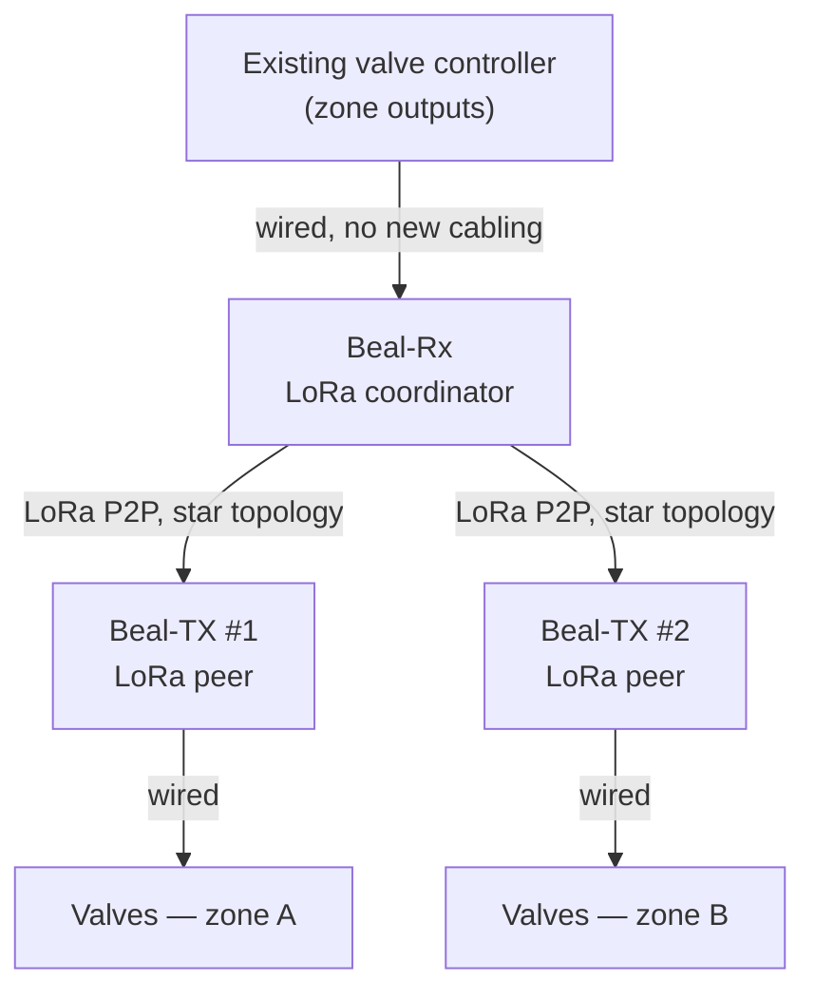

# Beal

Beal is a **LoRa valve-control proxy** that retrofits an existing irrigation
controller with remote, wire-free zone control.

## Why

Irrigation controllers are typically wire-only: reaching a new zone, or a
valve far from the controller box, means trenching new low-voltage wiring
across a working field — labor-intensive and disruptive.

Beal solves that wiring problem: clip a **RX** unit onto the existing
controller (no new wiring, no controller replacement) and place **TX** units
directly at the valves; they talk over LoRa, so control reaches valves
without trenching.

## How it works

Two dedicated boards make up one system:

| Board | Role | What it does |
| --- | --- | --- |
| [**Beal-Rx**](Beal-Rx/README.md) | Input | Clips onto the existing controller's zone-output wiring, senses which zone it's energizing, and reports over LoRa. Acts as the LoRa coordinator. |
| [**Beal-TX**](Beal-TX/README.md) | Output | Lives out at the valves, powered by its own battery + solar supply. Drives valve solenoids on command from Beal-Rx. Acts as a LoRa peer. |

The link between Beal-Rx and Beal-TX units is point-to-point LoRa, not
LoRaWAN: a custom, open-source stack with a star topology. Beal-Rx is the
coordinator — it's where commands originate and it's already the central
device by virtue of being wired to the existing controller. Beal-TX units are
peer nodes that take commands from it. LoRaWAN is deliberately avoided for
now — it would require network-server infrastructure disproportionate to
stand up and operate for this product.

## Repository layout

| Folder | What it is |
| --- | --- |
| [`Beal-Rx/`](Beal-Rx/README.md) | Input board: KiCad project, schematics, PCB. |
| [`Beal-TX/`](Beal-TX/README.md) | Output board: KiCad project, schematics, PCB. |
| `Beal-Common/` | Reusable elements shared between boards — currently footprints, with symbol libraries and design blocks planned. |

Schematic PDFs and BOMs are generated automatically on every push via
[`.github/workflows/kicad-schematic-pdf.yml`](.github/workflows/kicad-schematic-pdf.yml).

## What's next: Beal Controller

Both boards share the same LoRa-E5-centric approach, which is also the seed
for a future third board — tentatively **Beal Controller**. It would be a
smart irrigation controller with its own valve outputs and smart features
(weather-driven scheduling, ET0 computation, local web UI), while still able
to control remote valves over LoRa through a Beal-TX unit — replacing the
third-party controller entirely instead of just retrofitting it. This is a
future direction, not yet designed.

## License

Hardware design files are licensed under the
[CERN Open Hardware Licence Version 2 - Strongly Reciprocal](LICENSE).

## Open items

- [ ] Battery chemistry/capacity for the Beal-TX power pack — not yet sized.
- [ ] Enclosure — to do, no design started.
- [ ] Regulatory/certification path for the radio — not started; complicated
      by the use of a custom (non-LoRaWAN) PHY/MAC stack.
- [ ] Unit cost target (below 250 € incl. VAT) — needs re-costing against the
      current RX/TX design.
- [ ] Beal Controller — not designed yet; see above.
